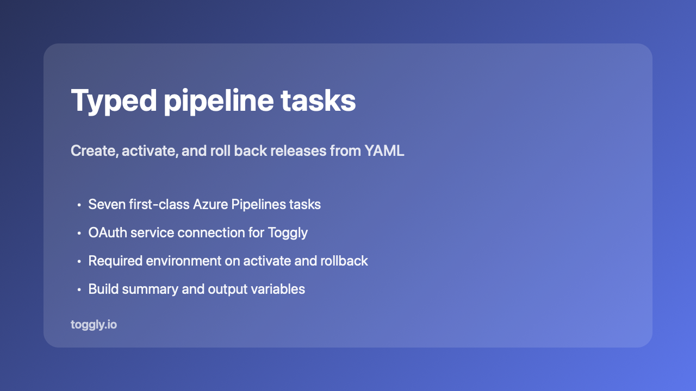
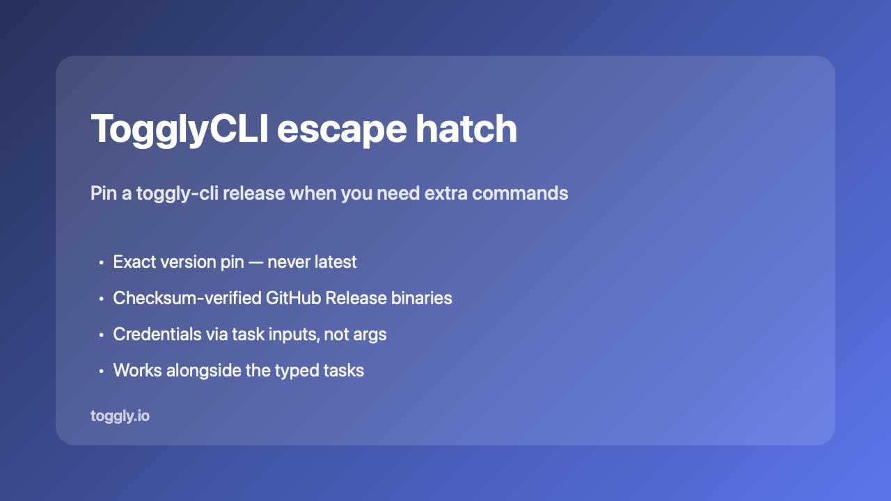

# Toggly Feature Flags for Azure DevOps

Ship feature changes with the same pipeline that ships your code.

This extension connects Azure Pipelines to [Toggly](https://toggly.io) so you can create flags, track releases, activate with quality gates, and roll back from YAML — using a Toggly service connection.

**Docs:** [Azure DevOps integration](https://docs.toggly.io/integrations/azure-devops) · **Site:** [toggly.io](https://toggly.io)

---

## What you get

- **Seven typed tasks** for the common flag and release workflows
- **Toggly service connection** (OAuth2 client credentials)
- **Output variables** such as `Toggly.ReleaseId` for later steps
- **Build summary** markdown so release context shows on the run
- **`TogglyCLI@1`** escape hatch when you need a pinned CLI command



---

## Quick start

1. Install this extension in your Azure DevOps organization.
2. Project Settings → Service connections → **New service connection** → **Toggly Feature Flags**. Set API URL to `https://app.toggly.io/api`, then enter Client ID and Client Secret from [app.toggly.io](https://app.toggly.io) (Team Settings → API Credentials).
3. Add a task to your pipeline. After you pick a Toggly service connection, workspace, application, and environment dropdowns load from Toggly. You can still type an ID if the list is empty.

```yaml
- task: TogglyActivateRelease@1
  inputs:
    connectedService: 'Toggly-Production'
    releaseId: '$(Toggly.ReleaseId)'
    environment: 'Production'
```

Activate and rollback **require** `environment` (sent as the API query parameter).

---

## Typed pipeline tasks

| Task | What it does |
| --- | --- |
| `TogglyCreateRelease@1` | Create a release |
| `TogglyAssociateBuild@1` | Link the current build to a release |
| `TogglyCreateFeature@1` | Create a feature flag |
| `TogglyUpdateFeature@1` | Update feature metadata |
| `TogglyUpdateFeatureEnv@1` | Enable, disable, or set filters per environment |
| `TogglyActivateRelease@1` | Activate a release (optional gate wait) |
| `TogglyRollbackRelease@1` | Roll back a release |

Default API base: `https://app.toggly.io/api` (calls use `api/v2`).

---

## TogglyCLI@1 (escape hatch)

Use when you need a pinned [`toggly-cli`](https://docs.toggly.io/sdks/cli) binary for commands outside the typed tasks.



| Input | Required | Notes |
| --- | --- | --- |
| `version` | yes | Exact `MAJOR.MINOR.PATCH` (for example `0.2.1`). Never `latest`. |
| `args` | yes | Quote-aware CLI arguments. **Do not put secrets here.** |
| `clientId` / `clientSecret` | yes | Mapped to `TOGGLY_CLIENT_*` for the CLI |
| `baseUrl` / `authority` | no | Optional overrides |

Agents need Python 3 (`python3` or `python`) on `PATH`.

```yaml
- task: TogglyCLI@1
  inputs:
    version: "0.2.1"
    clientId: $(TOGGLY_CLIENT_ID)
    clientSecret: $(TOGGLY_CLIENT_SECRET)
    args: >-
      associate-build
      --project-key my-app
      --environment Production
      --ci-provider azure-devops
      --run-id $(Build.BuildId)
      --pipeline-name "$(Build.DefinitionName)"
      --branch $(Build.SourceBranchName)
      --commit-sha $(Build.SourceVersion)
      --build-number $(Build.BuildNumber)
```

---

## Secrets

Use secret pipeline variables and the service connection (or CLI task inputs). Never put client secrets in `args` or commit them to YAML.

---

## Learn more

- Full guide: [docs.toggly.io/integrations/azure-devops](https://docs.toggly.io/integrations/azure-devops)
- Source: [ops-ai/toggly-azure-devops](https://github.com/ops-ai/toggly-azure-devops)
- Support: [toggly.io/support](https://toggly.io/support)
